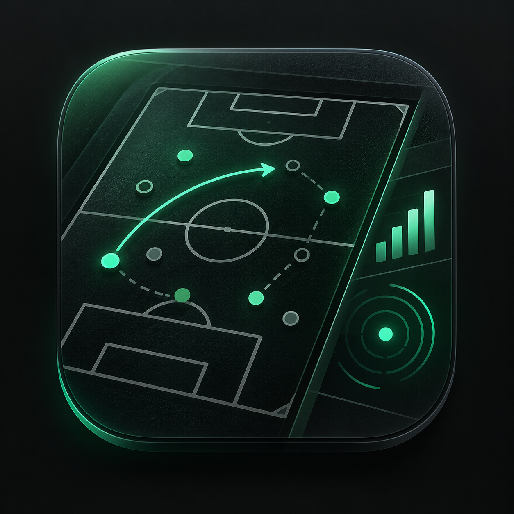

# Touchline Live

A native macOS scouting application for Football Manager 2024. Capture the player
database once, detach from the game, then search, sort, filter and inspect players
locally.

## Features

- A reusable native player table, advanced scouting filters and a detailed profile.
- Current and potential ability, attributes, hidden data, traits and reputation.
- Parent club, weekly wage, contract expiry and verified Asking Price.
- Display-currency switching using the captured game's currency definitions.
- A local shortlist, Role Focus attribute highlighting and optional Projected attributes.
- Player faces from an existing FM facepack, selected through Settings.
- Offline browsing of the latest saved capture.

## Supported environment

- **macOS 13 or later, Apple Silicon FM24.** Live capture supports one verified
  executable build; other FM versions, builds and Intel FM24 are unsupported.
- **Python 3.10 or later** for live capture. Touchline discovers a compatible local
  interpreter; Python is not bundled.
- **SIP Debugging Restrictions disabled for live capture.** Other SIP protections
  can remain enabled; cached/offline browsing does not need process access.
- Apple's **command-line developer tools** to build the app: Swift, clang++, SDK
  and `sips`. Runtime dependencies are the Python standard library and Apple APIs.

The reader checks both executable SHA-256 and image UUID before decoding the
build-specific layout. This gate is deliberate: changing constants does not make
another build compatible.

## Build

```sh
sh build-app.sh
```

Open the generated `Touchline Live.app` from a **user-writable folder**. Player
captures are stored in `app-data/` beside the app. Keep that folder when moving an
existing installation if you want to retain its latest capture.

## macOS security requirement

Touchline captures player data by reading the running Football Manager process.
The helper is read-only, but macOS System Integrity Protection (SIP) can still
block one application from accessing another application's memory. This is the
same general macOS process-protection issue documented by
[FMRTE](https://www.fmrte.com/blogs/entry/3-macos-unable-to-open-process/).

On the supported Apple Silicon test system, live refresh was verified to fail with
full SIP enabled and to work with only **Debugging Restrictions** disabled. Kext
Signing, Filesystem Protections, DTrace Restrictions, NVRAM Protections, BaseSystem
Verification, Boot-arg Restrictions, Kernel Integrity Protections and Authenticated
Root Requirement remained enabled.

Changing any SIP setting reduces macOS security and creates a custom SIP
configuration. Apple documents SIP as a system security protection:
[About System Integrity Protection](https://support.apple.com/en-us/102149).
Proceed only if you understand and accept that tradeoff. Touchline does **not**
require full SIP to be disabled, and you should not disable additional protections
for Touchline.

### Apple Silicon setup

1. Shut down the Mac.
2. Press and hold the power button until **Loading startup options** appears.
3. Choose **Options → Continue** to enter macOS Recovery.
4. In Recovery, open **Utilities → Terminal**.
5. Run:

   ```sh
   csrutil enable --without debug
   ```

6. Restart into macOS.
7. In a normal Terminal window, verify the resulting configuration:

   ```sh
   csrutil status
   ```

The expected result is a custom SIP configuration with **Debugging Restrictions:
disabled** while the other protections listed above remain enabled.

If the command is rejected, or `csrutil status` shows additional protections
disabled, re-enable SIP instead of weakening more protections and report your
macOS version in an issue.

### Restore normal SIP

To restore the default protection later, return to Recovery Terminal and run:

```sh
csrutil enable
```

Then restart. With full SIP restored, Touchline's live refresh will be blocked,
but an existing local capture can still be browsed offline.

## Usage

1. Open the supported FM24 build and load a career.
2. Open Touchline and choose **Refresh Live Data**.
3. Authorize the read-only helper through macOS when prompted. The current build
   may show an `osascript` administrator-password dialog during each live refresh.
4. After capture and confirmed detach, browse the cached players locally.

Search, filters, sorting, currency selection, Role Focus and Projected mode do
not reread FM. Reopening Touchline loads the latest cache without another capture.
A first launch has no bundled player database.

For player faces, open **Settings → Graphics → Player faces → Choose…** and select
an FM graphics root or facepack folder. Touchline reads the pack's `config.xml`
mappings and images in place; it does not install or copy them. The indexed mapping
is cached locally. Players without a readable face use a muted placeholder.

## Read-only and local data

The helper acquires a read-only task port, performs bounded reads and releases the
attachment before cache publication. Touchline does not edit FM memory or alter save
files. Live capture requires the SIP debug-only configuration described above. It
has no network service or telemetry.

Player captures remain beside the app; shortlist/preferences and the disposable
face index use per-user macOS storage. Optional diagnostic logs are disabled by
default. `TOUCHLINE_DEBUG_LOGS=1` enables local logs that may contain filesystem paths.

## Limitations

- A capture validates collection consistency but is not an atomic snapshot of all
  scalar fields. Keep the game idle during capture; a changing collection is rejected.
- True market value remains unresolved; Asking Price is labeled distinctly.
- Unresolved fields are not guessed. Some trait bits and club-affinity personality
  cases remain unmapped.
- Projected attributes are a scouting estimate, not a prediction from FM's simulation.
- Protected/read-only install locations are unsupported by the adjacent-cache layout.
- This source repository does not supply a signed/notarized binary or certify other
  FM/macOS configurations.

## Development

See [architecture](docs/ARCHITECTURE.md), [contributing](CONTRIBUTING.md) and
[source packaging](docs/PUBLIC_SOURCE.md). Portable tests use synthetic inputs and
do not attach to FM or open the GUI:

```sh
python3 -B -m unittest discover -s src -p 'test_*.py'
python3 -B -m unittest discover -s tests -p 'test_*.py'
sh test-query.sh
sh test-runtime.sh
sh test-faces.sh
sh test-shortlist.sh
sh test-projection.sh
sh test-role-focus.sh
sh test-personality.sh
```

## License and attribution

Touchline Live is open source under the [MIT License](LICENSE). See
[attribution and provenance](docs/ATTRIBUTION.md) for source credits and origins.

AI-assisted development was used in this project.
